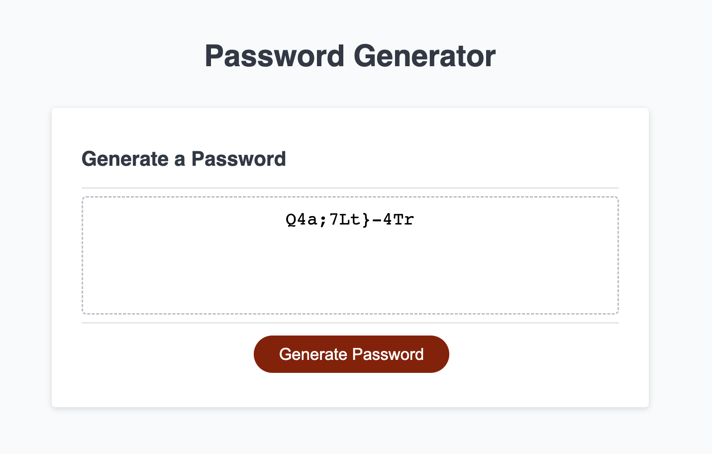

# Password Generator

Uses Javascript's Math.random method (which isn't particularly random) to create a password of specified length and character types. 

### Here's what I did: 

1. Created arrays of all possible character choices. 
2. Wrote prompts to capture user preferences for character count and type
3. Wrote logic for determining how many characters to pull from each chosen character type's array
4. In the common case that the character count isn't cleanly divisible by the number of types selected, I pull the remaining number of characters needed from a superarray that has all character types.
5. Since the password is always populated in order of lowercase > uppercase > number > symbol (> remainder) the password should be randomized one more time or it will always have the same format. So I shuffle the password using a shuffle method I found on <a href='https://stackoverflow.com/a/46545530.'> StackOverflow.</a> Thanks <a href="https://stackoverflow.com/users/687677/superluminary">@Superluminary</a>!
6. Wrote error handling for cases where the user chooses too many or too few characters or fails to specify at least one type of character. 
7. Cleaned up debugging text and added some more comments for clarity.
8. <a href= "https://cheloe.github.io/Password-Generator/">Deployed </a>, took screenshots, and finished up this README.

## Screenshots of deployed site:  
 

#### Used window prompts to capture user preferences:
  
  

#### Password too short/long error:

  

#### Passwords must have characters error:

  

#### A successfully generated password:

  

## Here's another <a href= "https://cheloe.github.io/Password-Generator/"> link to the deployed site!</a>

